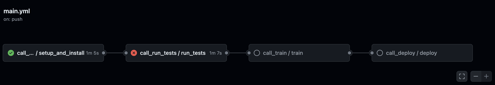

# MLOps Pipeline com CI/CD usando GitHub Actions

Este projeto demonstra a implementação de um pipeline de MLOps para um problema de regressão utilizando XGBoost. O pipeline integra ferramentas de tracking de experimentos (CometML), monitoramento de dados (Evidently), e banco de dados (MongoDB Atlas). O pipeline de CI/CD é orquestrado pelo GitHub Actions.

## Tecnologias Usadas

<p align="center">
  
  
  
  
  
  
  
</p>


## Estrutura de Diretórios

```plaintext
project-root/
├── .github/
│   └── workflows/
│       ├── main.yml
│       ├── setup_and_install.yml
│       ├── run_tests.yml
│       ├── deploy.yml
│       └── train.yml
├── data/
│   ├── featurization.py
│   ├── insert_data.py
├── models/
│   ├── train.py
│   └── deploy.py
├── tests/
│   ├── test_featurization.py
│   ├── test_insert_data.py
│   ├── test_train.py
│   ├── test_integration.py
│   ├── test_api.py
│   └── test_data_processing.py
├── app/
│   └── main.py
├── frontend/
│   └── app.py
├── images/
│   ├── github_actions_logo.png
│   ├── fastapi_logo.png
│   ├── xgboost_logo.png
│   ├── cometml_logo.png
│   ├── evidently_logo.png
│   ├── mongodb_atlas_logo.png
│   ├── python_logo.png
│   ├── pipeline_diagram.png
│   └── cicd_diagram.png
└── requirements.txt
```
## Características Técnicas

### 1. Ingestão de Dados

Os dados são carregados a partir do MongoDB Atlas. O script `insert_data.py` insere dados do conjunto de dados público `California Housing` no MongoDB.

### 2. Featurização

O script `featurization.py` processa os dados carregados, criando novas variáveis derivadas e realizando a normalização dos dados.

### 3. Treinamento do Modelo

O script `train.py` realiza o treinamento de um modelo de regressão usando XGBoost. As métricas do modelo são logadas no CometML.

### 4. Monitoramento

O monitoramento de dados é realizado utilizando a ferramenta Evidently para detectar drifts nos dados.

### 5. CI/CD com GitHub Actions

O pipeline CI/CD é dividido em várias etapas que são executadas em uma ordem específica para garantir que o código seja configurado, testado, treinado e implantado corretamente.

### main.yml (Workflow Principal)
- **Acionado por:** Push na branch `main`.
- **Função:** Orquestra a execução dos outros workflows em ordem.

### setup_and_install.yml
- **Acionado por:** Chamado pelo `main.yml`.
- **Função:** Configura o ambiente e instala as dependências.

### run_tests.yml
- **Acionado por:** Chamado pelo `main.yml` após `setup_and_install.yml`.
- **Função:** Executa todos os testes para garantir que o código está funcionando corretamente.

### train.yml
- **Acionado por:** Chamado pelo `main.yml` após `run_tests.yml`.
- **Função:** Treina o modelo de machine learning.

### deploy.yml
- **Acionado por:** Chamado pelo `main.yml` após `train.yml`.
- **Função:** Implanta o modelo treinado.

### 6. Servindo o Modelo

O script `main.py` fornece um endpoint API para previsões online e em batch, utilizando autenticação JWT.

## Setup
### 1. Criação de Contas

#### CometML

1. Acesse [CometML](https://www.comet.ml/) e crie uma conta.
2. Crie um novo projeto no CometML.
3. Gere uma API Key em `Settings -> API Keys`.
4. Anote o nome do workspace, do projeto e a API Key.

#### MongoDB Atlas

1. Acesse [MongoDB Atlas](https://www.mongodb.com/cloud/atlas) e crie uma conta.
2. Crie um novo cluster.
3. Configure um usuário e uma senha para acessar o cluster.
4. Anote a URI de conexão do MongoDB Atlas.

### 2. Cadastro das Secrets no GitHub


1. Vá para o repositório do seu projeto no GitHub.

2. Clique na aba `Settings` (Configurações) no menu superior do repositório.

3. No menu lateral esquerdo, clique em `Secrets and variables`.
4. Clique em `Actions`.
5. Clique no botão `New repository secret` (Novo secret do repositório).
6. Adicione os seguintes secrets com seus respectivos valores:

- **COMET_API_KEY**: A chave da API do CometML.
- **MONGODB_URI**: A URI de conexão com o MongoDB Atlas.
- **DATABASE_NAME**: O nome do banco de dados no MongoDB.
- **COLLECTION_NAME**: O nome da coleção no MongoDB.
- **SECRET_KEY**: A chave secreta para autenticação JWT.
- **COMET_WORKSPACE**: O nome do workspace do CometML.
- **COMET_MODEL_NAME**: O nome do modelo no CometML.
- **COMET_PROJECT_NAME**: O nome do projeto no CometML.
- **API_TOKEN**: O token de API para autenticação.

#### Exemplo de Adição de Secret

1. Clique em `New repository secret`.
2. No campo `Name`, insira `COMET_API_KEY`.
3. No campo `Value`, insira sua chave da API do CometML.
4. Clique no botão `Add secret`.

Repita os passos acima para cada um dos secrets mencionados.

#### 6. Verificação

1. Após adicionar todos os secrets, você pode verificá-los na lista de secrets do repositório. Certifique-se de que todos os secrets necessários estão listados e com os valores corretos.


## Instruções para Uso

### 1. Configuração do Ambiente

#### Instalação do Python 3.9

1. **Windows**:
    - Baixe o instalador do Python 3.9 em [python.org](https://www.python.org/downloads/release/python-390/).
    - Execute o instalador e siga as instruções, certificando-se de selecionar a opção "Add Python to PATH".
    - Verifique a instalação abrindo um terminal e digitando:
      ```bash
      python --version
      ```

2. **macOS**:
    - Abra o terminal e instale o Python 3.9 usando Homebrew:
      ```bash
      brew install python@3.9
      ```
    - Verifique a instalação digitando:
      ```bash
      python3.9 --version
      ```

3. **Linux**:
    - Abra o terminal e instale o Python 3.9 usando o gerenciador de pacotes da sua distribuição. Por exemplo, no Ubuntu:
      ```bash
      sudo apt update
      sudo apt install python3.9 python3.9-venv python3.9-dev
      ```
    - Verifique a instalação digitando:
      ```bash
      python3.9 --version

#### Configuração do Projeto
1. Clone o repositório:
    ```bash
    git clone https://github.com/sjose03/data_master_eng_ml.git
    cd data_master_eng_ml
    ```

2. Crie e ative um ambiente virtual Python (recomendado):
    ```bash
    python3.9 -m venv venv
    source venv/bin/activate  # Para Windows use `env\Scripts\activate`
    ```

3. Instale as dependências:
    ```bash
    python3 -m pip install --upgrade pip
    pip install -r requirements.txt
    ```

4. Configure as variáveis de ambiente para CometML e MongoDB Atlas:
    - Crie um arquivo `.env` na raiz do projeto com o seguinte conteúdo:
      ```
      COMET_API_KEY=your-comet-api-key
      MONGODB_URI=your-mongodb-atlas-uri
      DATABASE_NAME=your-database-name
      COLLECTION_NAME=your-collection-name
      SECRET_KEY=your-secret-key
      COMET_WORKSPACE=your-comet-workspace
      COMET_MODEL_NAME=your-comet-model-name
      COMET_PROJECT_NAME=your-comet-project-name
      ```

### 2. Ingestão de Dados

Execute o script para inserir dados no MongoDB Atlas:
```bash
python data/insert_data.py
```
### 3. Treinamento do Modelo
Execute o script de treinamento:

```bash
python models/train.py
```

### 4. Servir o Modelo
Execute o servidor API:

```bash
uvicorn app.main:app --host 0.0.0.0 --port 8000
```

## Diagrama do Pipeline CI/CD



O diagrama acima ilustra o fluxo de trabalho dos workflows do GitHub Actions. A ordem de execução é a seguinte:

1. **main.yml:** Inicia o processo e chama os workflows subsequentes.
2. **setup_and_install.yml:** Configura o ambiente e instala as dependências.
3. **run_tests.yml:** Executa os testes.
4. **train.yml:** Treina o modelo.
5. **deploy.yml:** Implanta o modelo treinado.


## Evoluções Futuras

1. **Automatizar a criação e configuração do ambiente**:
   - Utilizar ferramentas como Docker para garantir que o ambiente seja replicável.

2. **Aprimorar a Featurização**:
   - Adicionar técnicas mais avançadas de engenharia de features.
   - Implementar seleção automática de features.

3. **Melhorar a Monitoria**:
   - Implementar alertas automáticos quando houver drift nos dados.
   - Integrar mais métricas de monitoramento.

4. **Expandir Testes**:
   - Adicionar testes de carga e desempenho para o endpoint API.
   - Implementar testes de validação de dados.

5. **Aprimorar a Segurança**:
   - Implementar autenticação e autorização mais robustas para a API.
   - Garantir a conformidade com as melhores práticas de segurança.