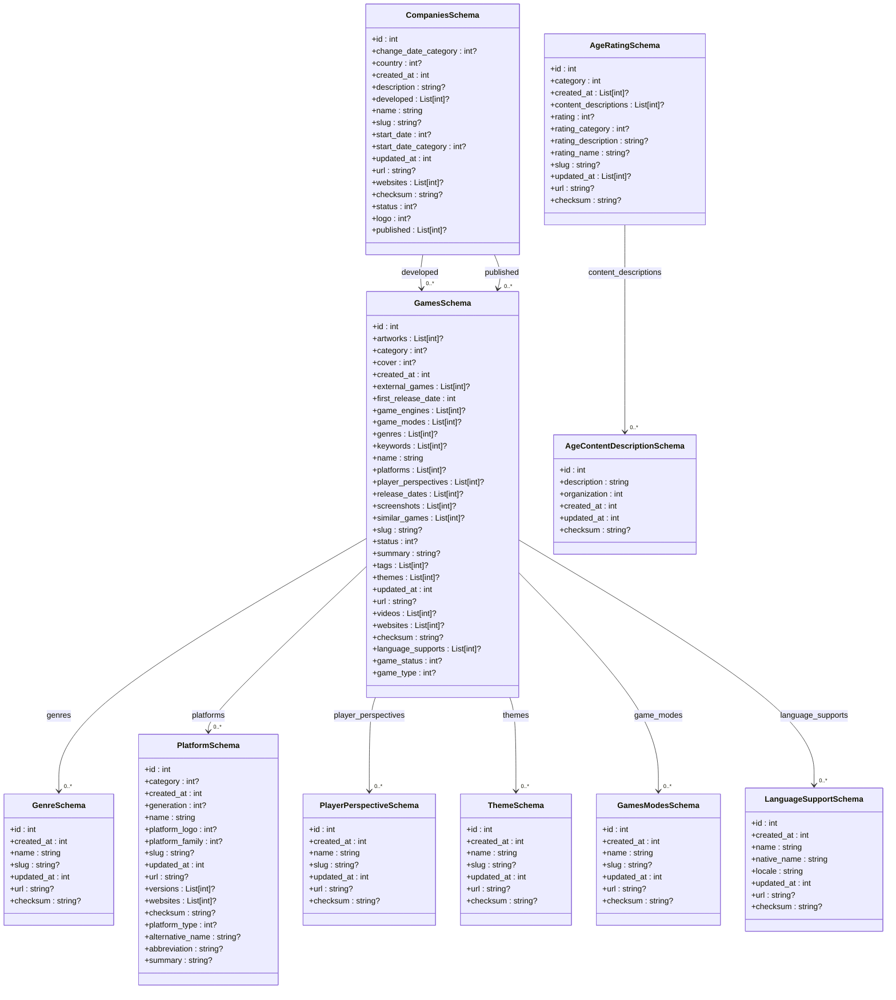

# Data Master: Machine Learning Engineering

Este repositório contém um projeto completo de engenharia de machine learning, focado na coleta, processamento e modelagem de dados da API do IGDB (Internet Game Database). O objetivo do projeto é prever se um jogo terá avaliações, utilizando um modelo de classificação binária, com todo o processo de treinamento monitorado pelo MLFlow.

## Diagrama de Classes

A seguir, veja o diagrama de classes que representa os esquemas de dados utilizados no projeto:


```mermaid
classDiagram
    class GamesSchema {
        +id : int
        +artworks : List[int]?
        +category : int?
        +cover : int?
        +created_at : int
        +external_games : List[int]?
        +first_release_date : int
        +game_engines : List[int]?
        +game_modes : List[int]?
        +genres : List[int]?
        +keywords : List[int]?
        +name : string
        +platforms : List[int]?
        +player_perspectives : List[int]?
        +release_dates : List[int]?
        +screenshots : List[int]?
        +similar_games : List[int]?
        +slug : string?
        +status : int?
        +summary : string?
        +tags : List[int]?
        +themes : List[int]?
        +updated_at : int
        +url : string?
        +videos : List[int]?
        +websites : List[int]?
        +checksum : string?
        +language_supports : List[int]?
        +game_status : int?
        +game_type : int?
    }

    class PlatformSchema {
        +id : int
        +category : int?
        +created_at : int
        +generation : int?
        +name : string
        +platform_logo : int?
        +platform_family : int?
        +slug : string?
        +updated_at : int
        +url : string?
        +versions : List[int]?
        +websites : List[int]?
        +checksum : string?
        +platform_type : int?
        +alternative_name : string?
        +abbreviation : string?
        +summary : string?
    }

    class PlayerPerspectiveSchema {
        +id : int
        +created_at : int
        +name : string
        +slug : string?
        +updated_at : int
        +url : string?
        +checksum : string?
    }

    class GenreSchema {
        +id : int
        +created_at : int
        +name : string
        +slug : string?
        +updated_at : int
        +url : string?
        +checksum : string?
    }

    class ThemeSchema {
        +id : int
        +created_at : int
        +name : string
        +slug : string?
        +updated_at : int
        +url : string?
        +checksum : string?
    }

    class CompaniesSchema {
        +id : int
        +change_date_category : int?
        +country : int?
        +created_at : int
        +description : string?
        +developed : List[int]?
        +name : string
        +slug : string?
        +start_date : int?
        +start_date_category : int?
        +updated_at : int
        +url : string?
        +websites : List[int]?
        +checksum : string?
        +status : int?
        +logo : int?
        +published : List[int]?
    }

    class AgeRatingSchema {
        +id : int
        +category : int
        +created_at : List[int]?
        +content_descriptions : List[int]?
        +rating : int?
        +rating_category : int?
        +rating_description : string?
        +rating_name : string?
        +slug : string?
        +updated_at : List[int]?
        +url : string?
        +checksum : string?
    }

    class LanguageSupportSchema {
        +id : int
        +created_at : int
        +name : string
        +native_name : string
        +locale : string
        +updated_at : int
        +url : string?
        +checksum : string?
    }

    class AgeContentDescriptionSchema {
        +id : int
        +description : string
        +organization : int
        +created_at : int
        +updated_at : int
        +checksum : string?
    }

    class GamesModesSchema {
        +id : int
        +created_at : int
        +name : string
        +slug : string?
        +updated_at : int
        +url : string?
        +checksum : string?
    }

    %% Associações sugeridas
    GamesSchema --> "0..*" GenreSchema : genres
    GamesSchema --> "0..*" PlatformSchema : platforms
    GamesSchema --> "0..*" PlayerPerspectiveSchema : player_perspectives
    GamesSchema --> "0..*" ThemeSchema : themes
    GamesSchema --> "0..*" GamesModesSchema : game_modes
    GamesSchema --> "0..*" LanguageSupportSchema : language_supports

    CompaniesSchema --> "0..*" GamesSchema : developed
    CompaniesSchema --> "0..*" GamesSchema : published

    AgeRatingSchema --> "0..*" AgeContentDescriptionSchema : content_descriptions
```

## Sumário

- [Visão Geral](#visão-geral)
- [Estrutura do Projeto](#estrutura-do-projeto)
- [Instalação](#instalação)
- [Uso](#uso)
- [Contribuição](#contribuição)
- [Licença](#licença)

## Visão Geral

Este projeto implementa um pipeline completo de machine learning que inclui:

- **Coleta de Dados:** Extração de informações da API do IGDB.
- **Ingestão de Dados:** Armazenamento dos dados brutos no MongoDB.
- **Treinamento de Modelos:** Desenvolvimento de um modelo de classificação binária para prever se um jogo possui avaliações.
- **Monitoramento com MLFlow:** Acompanhamento dos experimentos de treinamento em tempo real.

## Estrutura do Projeto

A estrutura do repositório organiza os dados, a documentação e os scripts de análise/modelagem de forma clara:

```plaintext
data_master_eng_ml/
├── data/
│   └── raw/                          # Dados brutos coletados
│       ├── twitch_api_data_2021.csv  
│       └── twitch_api_data_2022.csv
├── docs/                             # Documentação do projeto
│   └── docs/
│       ├── mkdocs.yml                # Configuração da documentação
│       └── README.md
├── notebooks/                        # Jupyter notebooks para análise e modelagem
│   ├── analise.ipynb                 # Notebook de análise de dados
│   ├── modelagem.ipynb               # Notebook de modelagem
│   ├── analise_nova.ipynb            # Versão atualizada do notebook de análise
│   └── modelagem_nova.ipynb          # Versão atualizada do notebook de modelagem
├── reports/                          # Relatórios e figuras gerados
│   └── figures/
├── .gitignore                        # Arquivos e diretórios ignorados pelo Git
├── Makefile                          # Comandos utilitários para automação
├── pyproject.toml                    # Configuração de ambiente e dependências
├── README.md                         # Este README
└── requirements.txt                  # Dependências Python necessárias
```

## Instalação

### Pré-requisitos

- **Python 3.10**
- **MongoDB**
- **API Key do IGDB**
- **MLFlow**

### Passos

1. **Clone o repositório:**
    ```bash
    git clone https://github.com/sjose03/data_master_eng_ml.git
    cd data_master_eng_ml
    ```

2. **Instale as ferramentas necessárias:**

    - **pipx:**
        ```bash
        python3 -m pip install --user pipx
        python3 -m pipx ensurepath
        ```

    - **pipenv:**
        ```bash
        pipx install pipenv
        ```

    - **pyenv:**
        ```bash
        curl https://pyenv.run | bash
        ```

    - **Dependências adicionais (WSL):**
        ```bash
        sudo apt-get install libffi-dev libssl-dev libreadline-dev \
        libbz2-dev libsqlite3-dev lzma liblzma-dev python3-tk
        ```

3. **Configure o ambiente Python:**

    - Instale a versão do Python:
        ```bash
        pyenv install 3.10
        ```
    - Crie o ambiente com o `Makefile`:
        ```bash
        make create_environment
        ```
    - Ative o ambiente:
        ```bash
        pipenv shell
        ```
    - Instale os requisitos do projeto:
        ```bash
        make requirements
        ```

4. **Configure as variáveis de ambiente:**

    Crie um arquivo `.env` na raiz do projeto com o seguinte conteúdo:
    ```env
    TWITCH_ID=<sua_twitch_id>
    TWITCH_SECRET=<sua_twitch_secret>
    MONGODB_URI=<sua_uri_mongodb>
    DAGSHUB_TOKEN=<seu_token_dagshub>
    ```

## Uso

### Coleta e Ingestão de Dados

Utilize os notebooks ou scripts disponíveis para extrair dados da API do IGDB e armazená-los no MongoDB.

### Treinamento de Modelos

1. Execute os notebooks de modelagem (`modelagem.ipynb` ou `modelagem_nova.ipynb`) para treinar o modelo de classificação binária.
2. Utilize o MLFlow para monitorar e registrar os experimentos.

## Contribuição

Contribuições são bem-vindas! Para contribuir:

1. Abra uma issue explicando sua proposta de melhoria.
2. Faça um fork do repositório e envie um pull request com suas alterações.
3. Certifique-se de que os testes passem e siga o padrão do projeto.

## Licença

Este projeto está licenciado sob a [Licença MIT](LICENSE).

---

### Melhorias Aplicadas
- Estruturação aprimorada das seções e formatação do conteúdo.
- Atualização e aprimoramento do diagrama de classes com Mermaid.
- Inclusão das seções **Contribuição** e **Licença** para orientar a participação da comunidade.
- Instruções detalhadas para instalação e configuração do ambiente.
- Revisão geral e melhorias gramaticais para maior clareza e fluidez.
