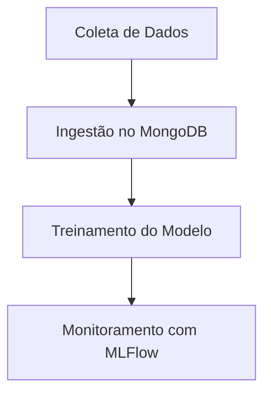

# Data Master: Machine Learning Engineering

Este repositório contém um projeto completo de engenharia de machine learning, focado na coleta, processamento e modelagem de dados da API do IGDB (Internet Game Database). O objetivo do projeto é prever se um jogo terá ou não avaliações, utilizando um modelo de classificação binária. Todo o processo de treinamento é monitorado pelo MLFlow.


```mermaid
graph TD;
    A[Coleta de Dados] --> B[Ingestão no MongoDB];
    B --> C[Treinamento do Modelo];
    C --> D[Monitoramento com MLFlow];
```

## Sumário

- [Visão Geral](#visão-geral)
- [Estrutura do Projeto](#estrutura-do-projeto)
- [Instalação](#instalação)
- [Uso](#uso)
- [Contribuição](#contribuição)
- [Licença](#licença)

## Visão Geral

Este projeto se concentra em várias etapas fundamentais de um pipeline de machine learning:

1. **Coleta de Dados**: Extração de dados da API do IGDB.
2. **Ingestão de Dados**: Armazenamento dos dados coletados no MongoDB.
3. **Treinamento de Modelos**: Utilização dos dados para treinar um modelo de classificação binária que prevê se um jogo possui ou não avaliações.
4. **Monitoramento com MLFlow**: Acompanhar o processo de treinamento e os experimentos de machine learning utilizando o MLFlow.

## Estrutura do Projeto

O repositório está organizado da seguinte forma:

```plaintext
data_master_eng_ml/
├── data/
│   └── raw/                          # Dados brutos coletados
│       ├── twitch_api_data_2021.csv  # Exemplo de dados de API
│       └── twitch_api_data_2022.csv
├── docs/                             # Documentação do projeto
│   └── docs/
│   ├── mkdocs.yml                    # Configuração da documentação
│   └── README.md
├── notebooks/                        # Jupyter notebooks para análise e modelagem
│   ├── analise.ipynb                 # Notebook de análise de dados
│   ├── modelagem.ipynb               # Notebook de modelagem
│   ├── analise_nova.ipynb            # Versão atualizada do notebook de análise
│   └── modelagem_nova.ipynb          # Versão atualizada do notebook de modelagem
├── reports/                          # Relatórios e figuras gerados
│   └── figures/
├── .gitignore                        # Arquivos e diretórios ignorados pelo Git
├── Makefile                          # Comandos utilitários para automação
├── pyproject.toml                    # Configuração de ambiente e dependências
├── README.md                         # Este README
└── requirements.txt                  # Dependências Python necessárias
```

## Instalação

### Pré-requisitos

- **Python 3.10**
- **MongoDB**
- **API Key do IGDB**
- **MLFlow**

### Passos

1. Clone o repositório:

    ```bash
    git clone https://github.com/sjose03/data_master_eng_ml.git
    cd data_master_eng_ml
    ```

2. Instale as ferramentas necessárias:

    - **Instale o pipx**
        - [Guia oficial de instalação do pipx](https://pipx.pypa.io/stable/)
        - Comando de instalação:

            ```bash
            python3 -m pip install --user pipx
            python3 -m pipx ensurepath
            ```

    - **Instale o pipenv**
        - [Guia oficial de instalação do pipenv](https://pipenv.pypa.io/en/latest/installation.html)
        - Comando de instalação:

            ```bash
            pipx install pipenv
            ```

    - **Instale o pyenv**
        - [Guia oficial de instalação do pyenv](https://github.com/pyenv/pyenv)
        - Comando de instalação:

            ```bash
            curl https://pyenv.run | bash
            ```

    - **Dependências adicionais no WSL**
        - Necessário apenas no WSL.
        - Comando de instalação:

            ```bash
            sudo apt-get install libffi-dev libssl-dev libreadline-dev \
            libbz2-dev libsqlite3-dev lzma liblzma-dev python3-tk
            ```

3. Configure o ambiente Python:

    - Instale a versão do Python:

        ```bash
        pyenv install 3.10
        ```

    - Crie o ambiente com o `Makefile`:

        ```bash
        make create_environment
        ```

    - Ative o ambiente:

        ```bash
        pipenv shell
        ```

    - Instale os requisitos do projeto:

        ```bash
        make requirements
        ```

4. Configure suas variáveis de ambiente:

    - Crie um arquivo `.env` na raiz do projeto com o seguinte conteúdo:

        ```env
        TWITCH_ID=<sua_twitch_id>
        TWITCH_SECRET=<sua_twitch_secret>
        MONGODB_URI=<sua_uri_mongodb>
        DAGSHUB_TOKEN=<seu_token_dagshub>
        ```

## Uso

### Coleta e Ingestão de Dados

Utilize os notebooks ou scripts disponíveis para extrair dados da API do IGDB e armazená-los no MongoDB.

### Treinamento de Modelos

1. Utilize os notebooks de modelagem (`modelagem.ipynb` ou `modelagem_nova.ipynb`) para treinar o modelo de classificação binária.
2. Monitore e registre os experimentos com MLFlow.

### Relatórios e Análises

Os notebooks de análise (`analise.ipynb` ou `analise_nova.ipynb`) oferecem insights sobre os dados coletados e as performances dos modelos.
